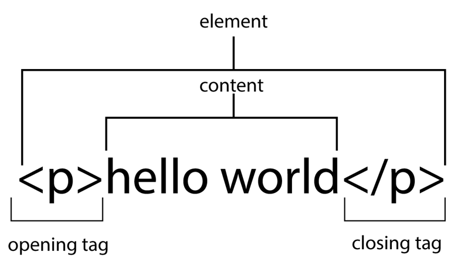
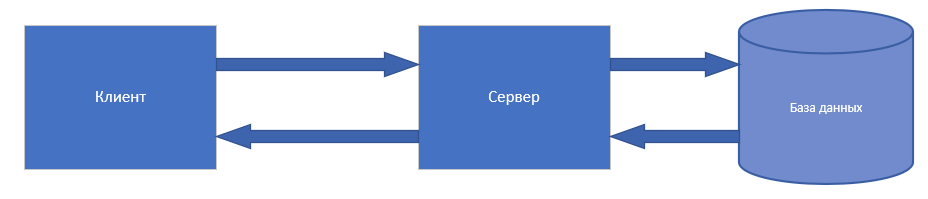
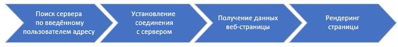
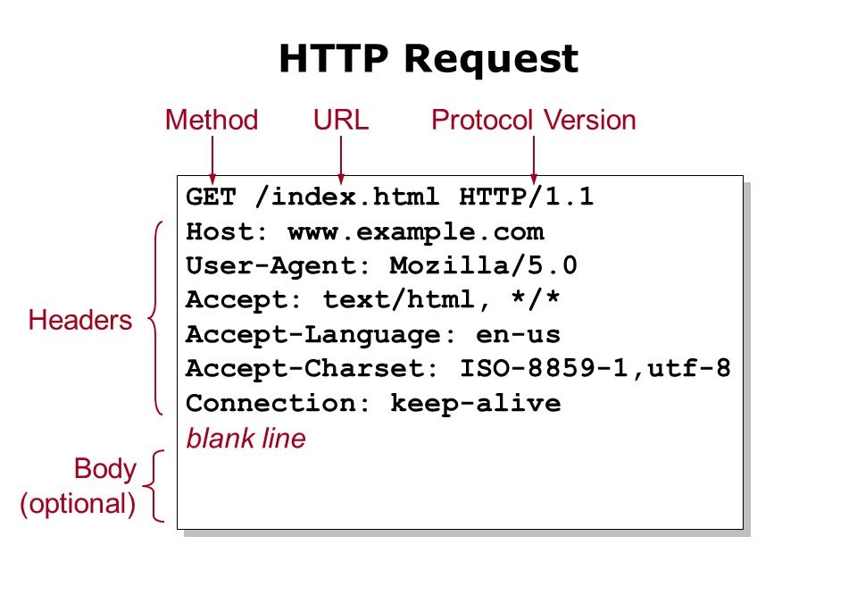

# Всемирная паутина

## Contents

1. [Chapter I](#chapter-i) \
    1.1. [Introduction](#introduction)
2. [Chapter II](#chapter-ii) \
    2.1. [Information](#information)
3. [Chapter III](#chapter-iii) \
    3.1. [Знакомство с вебом](#знакомство-с-вебом) \
    3.2. [Классы и объекты](#классы-и-объекты) \
    3.3. [Task 1](#task-1) \
    3.4. [Повторим библиотеки](#повторим-библиотеки) \
    3.5. [Pip](#pip) \
    3.6. [Requests](#requests) \
    3.7. [Task 2](#task-2) \
    3.8. [BS4](#bs4) \
    3.9. [Task 3](#task-3) 

## Chapter I

### Introduction

Привет, студент!
Теперь, когда ты закрепил свои навыки в программировании на Python, пришло время двигаться дальше. И сегодня мы с тобой окунемся в сферу веб-технологий.

## Chapter II

### Information

Не забывай, что наше обучение строится по принципу "равный равному" (P2P, peer-to-peer). P2P – это способ обучения, когда студенты помогают друг другу при возникновении каких-либо сложностей. Если ты столкнулся с чем-то непонятным, первым делом спроси у своих товарищей по курсу. Если ответа ты не получил, то обратись к Google. А получив ответ на свой вопрос, не забудь поделиться им с другими студентами!

Также хотим тебе напомнить, что перед выполнением задач нужно скопировать задания из папки `materials` в папку `src`, и выполнять всё нужно соответственно в `src`. Это можно сделать следующей командой:
```
cp -R materials/* src/
```

## Chapter III

### Знакомство с вебом

Прежде всего разберемся с тем, что такое эти веб-технологии. Web-технологии или интернет-технологии – это технологии создания и поддержки различных ресурсов в сети Интернет (сайтов, веб-приложений). Всё это, конечно, лишь общие слова. Чтобы более детально погрузиться в эту сферу, начнем издалека. А именно с момента зарождения Интернета.

Прародителем интернета считается проект Министерства обороны США ARPANET, развернутый в конце 60-х. Создан он был для обеспечения сети связи, способной выдержать ядерную атаку, то есть проект был военный. Однако довольно скоро стало понятно, что потенциал сети далеко выходит за рамки её первоначальной цели.

В 1989 британский ученый Тим Бернерс-Ли предложил идею создания такой системы, посредством которой можно было бы получать доступ к информации и обмениваться ей с помощью текстового интерфейса. Эту систему она назвал Всемирной паутиной (World Wide Web, в сокращении WWW или просто Web). Кстати, не путайте понятие Всемирной паутины и интернета. Интернет это глобальная система компьютерных сетей, связанных между собой, которая использует набор интернет-протоколов (подробнее об устройстве Интернета советуем почитать самостоятельно). А WWW является интернет сервисом, предоставляющим доступ к документам, размещенным на разных компьютерах, подключенных к интернету. Однако WWW настолько популярна, что эти понятия часто смешивают.

Простейшим элементом этой Всемирной паутины  является веб-страница. **Веб-страница** – это документ, который хранится у одного из пользователей WWW и имеет уникальный адрес (URL), по которому его можно найти. Совокупность веб-страниц, связанных друг с другом общей тематикой, дизайном и ссылками называется **веб-сайтом**. Все сайты в совокупности и составляют Всемирную паутину. Чтобы просматривать веб-страницы существуют специальные программы – браузеры, но о них чуть позже.

Выше ты прочитал что-то про уникальный адрес – URL. **URL (Uniform Resource Locator)** – это символьная строка позволяющая идентифицировать какой-либо ресурс в сети интернет. Выглядит он следующим образом:

http://www.example.com:80/path/to/myfile.html?key1=value1&key2=value2#SomewhereInTheDocument – знакомо, правда?

Именно его мы видим в строке браузера, когда сидим на каком-либо сайте. Состоит он из следующих элементов: протокол, доменное имя, порт, путь в файловой системе на сервере, дополнительные параметры, ссылка на позиционный маркер. О протоколах мы поговорим далее, Об остальных же элементах  ты можешь узнать в Google. Кстати, URL – лишь один из подходов к адресации ресурсов в сети. Больше по этой теме ты можешь узнать, снова воспользовавшись Google.

С этим разобрались. Мы знаем, что у каждой веб-страницы есть свой адрес по которому её можно найти. Теперь разберемся с тем, что из себя представляет веб-страница со всеми её надписями, картинками и кнопками “под капотом”. Любая страница в основе своей состоит из трёх частей кода: HTML, CSS и JavaScript. HTML (HyperText Markup Language) – язык разметки. Это самый базовый строительный блок Веба. Он определяет содержание и структуру веб-контента. Другие технологии, помимо HTML, используются для описания внешнего вида/представления (CSS) или функциональности/поведения (JavaScript) веб-страницы.

Под любой страницей скрыта следующая структура HTML-документа:
```
<!DOCTYPE html>
<html>
  <head>
  <meta charset="utf-8">
  <title>Моя страница</title>
  </head>
  <body>
  
  </body>
</html>
```
То, что вы видите – набор тегов, открывающих и закрывающих (вообще весь HTML-документ состоит из тегов). Документ имеет следующие разделы: 
1. `<!DOCTYPE html>` – этот элемент пришел из прошлого. Тогда он служил ссылкой на набор правил, которым должна следовать HTML-страница.
2. `<html></html>` – корневой элемент. В него обернут весь контент страницы.
3. `<head></head>` – контейнер для всей мета информации. Например, для кодировки документа или для заголовка страницы на вкладке браузера.
4. `<body></body>` – в нем содержится весь контент, который вы хотите показывать пользователям, когда они посещают вашу страницу, будь то текст, изображения, видео, игры, проигрываемые аудиодорожки или что-то ещё.

Давай теперь детально посмотрим на элемент языка HTML:



Главными частями нашего элемента являются:
1. Открывающий тег – состоит из имени элемента (в данном случае, "p"). Он указывает, где элемент начинается.
2. Закрывающий тег – выглядит как открывающий, но с косой чертой перед названием. Указывает, где элемент заканчивается.
3. Контент – контент элемента.
4. Также у элемента могут встречаться атрибуты и вложенные элементы. Подробнее о них и о синтаксисе HTML в целом спроси у Google.

**Клиент-сервер.** Вся Всемирная паутина построена на клиент-серверной архитектуре:



Простыми словами это работает следующим образом:

1. Клиент обращается к серверу с каким-то запросом, например Ваня Петров хочет узнать в банке может ли он взять кредит.
2. Сервер обрабатывает запрос от клиента, обращается в базу данных берет оттуда всю информацию по Ване Петрову, анализирует её.
3. Сервер выдает Ване ответ. 

Данная архитектура является крайне удобной, ведь она позволяет снизить нагрузку на клиентские устройства, за счет того, что все вычислительные операции происходят на мощном сервере.

**Поговорим теперь о браузерах.**

Веб-браузер — это программное приложение, которое позволяет пользователям получать доступ и просматривать веб-страницы в Интернете. 
В упрощенном виде процесс открытия браузером веб-страницы выглядит следующим образом:



**Получение данных веб-страницы**

**http-запрос**

На данном этапе происходит http-запрос от браузера к серверу и получение http-ответа от сервера. Что вообще такое этот ваш HTTP? HTTP (англ. HyperText Transfer Protocol — «протокол передачи гипертекста») – один из основных протоколов передачи данных в сети Интернет (также ты часто можешь увидеть протокол https, это тот же протокол HTTP, но защищенный) После того, как браузер (клиент) устанавливает соединение с сервером (подробнее об этом можете спросить у Google) он отправляет ему http-запрос на получение данных веб-страницы. Давай посмотрим, как он выглядит и из чего состоит:



Стартовая строка запроса состоит из трех элементов:
1. Метод HTTP, глагол или существительное, описывающие требуемое действие (весь перечень методов и их назначение можно погуглить). Например метод GET указывает, что требуется получить некоторый ресурс, а POST означает отправку данных на сервер
2. Цель запроса, обычно URL
3. Версия HTTP, обычно 1.1

Далее идут заголовки. Они содержат различную дополнительную информацию.

И, наконец, тело. В теле можно отправить любую информацию, в том числе и html-документ.

**http-ответ**

http-ответ сервера очень похож на запрос, однако стартовая строка – теперь строка статуса. Выглядит она так:

```
HTTP/1.1 404 Not Found.
```

Ее элементы: версия протокола, код состояния, пояснение. Код состояния – состоит из трёх цифр и говорит о том, какой ответ был получен. О всех видах кодов состояния спроси у Google.

**Панель разработчика**

Как мы уже выяснили, любая веб-страница состоит из трех частей кода (HTML, CSS, JS). А ты знал, что в браузере ты можешь просмотреть этот самый код?

Для этого существует панель разработчика. В Chrome открыть её ты можешь сочетанием Cmd + Option + I. Когда она откроется, перед тобой откроется возможность просмотра одной из этих панелей: Elements, Console, Sources, Network, Performance, Memory, Application, Security, Lighthouse. Подробно об их назначении и функционале можешь узнать самостоятельно.

При помощи инструментов разработчика (DevTools) у тебя есть возможность найти необходимый элемент на странице для этого во вкладке Elements нажми на кнопку со стрелкой в левом верхнем углу и кликни на элемент на странице. Всё, ты можешь посмотреть его код, удобно правда? Также можно редактировать CSS и JS страницы, проверять её отображение на разных типах устройств, искать всю необходимую тебе информацию на странице с помощью панели поиска.

### Классы и объекты

Для выполнения заданий, помимо базовых знаний о вебе, тебе потребуется знания о том, что такое класс и что такое объект. Объясним простыми словами. Класс – чертеж самолета, а реальные самолеты, которые по этому чертежу созданы, – объекты. Все они, поскольку собраны по одному чертежу, могут выполнять одни и те же действия – запускать двигатель, убирать шасси и др. Однако все эти самолёты могут быть разного цвета, принадлежать разным авиакомпаниям, иметь разные номера и названия – всё это их свойства, которые находятся в определённом состоянии.
Таким образом, класс – описание того, какими свойствами и каким поведением будет обладать объект, а объект – это экземпляр класса с собственным состоянием этих свойств.
Свойства или, как их принято называть, атрибуты являются переменными объекта. Это обычные переменные, характеризующие объект. Например, у человека в качестве атрибутов могут выступать числовые переменные: рост, вес, возраст. Поведение или методы – это функции объекта, т.е. действия, которые может выполнять объект. Человек может лечь спать, проснуться, пройти по комнате. Всё это может быть методами класса “Человек”.
Ниже как раз приведен пример простого класса “Человек”.

```
class Human:
  def __init__(self, height, weight, age):
    self.height = height
    self.weight = weight
    self.age = age

  def grow_up(self, height):
    self.height = self.height + height
```

У этого класса есть 3 атрибута: рост, вес и возраст. А также есть один метод – вырасти, который прибавляет к росту количество сантиметров, которое мы передадим. Осталась пара непонятных вещей – что за метод такой `__init__` и что за слово `self` повсюду? 
Метод `__init__` это особый метод, который есть у любого класса. Этот метод называется конструктором. Его главная задача конструировать объекты на основе класса. Вызывается он всякий раз при создании объекта. Он может принимать параметры как любой метод или функция. В нашем примере он принимает 3 параметра, значения которых присваивает атрибутам.
`self` — это ссылка на текущий экземпляр класса, cпособ обращения к атрибутам и методам класса изнутри самого класса. В нашем примере `self.height = height` устанавливает атрибут `height` текущего объекта класса Human в значение `height`, переданное в `__init__`.
Теперь создадим экземпляр класса `Human` и назовем его `student`. После чего попросим этого студента подрасти на 10 см.

```
student = Human(184, 85, 20)
print(student.height)
student.grow_up(10)
print(student.height)
```

В результате на экране мы увидим сначала рост равный 184, как мы и задумывали при создании, после чего рост увеличится и мы получим 194. 

Как можно заметить, доступ к атрибутам и методам объекта производится следующим образом: **имя_объекта.атрибут или имя_объекта.метод**. 
Чтобы потренироваться в работе с классами давай приступим к первому заданию дня!

### Task 1

В этом задании тебе предстоит переписать задачу #3 (неделя 2, день 1), выделив студента (с именем и фамилией) в качестве класса с двумя атрибутами и методом `get_full_name` для получения строки “`<name> <surname>`”.

Файлы для задания находятся в директории `materials/task1`.

Для сохранения результатов создай в директории `src` папку `task1` и сохрани в неё файлы с решением.

### Повторим библиотеки

Двигаемся дальше. Сегодня тебе предстоит поработать с кодом страницы. Для этого понадобится использовать пару библиотек. Давай вспомним как их подключать. Сделать это можно с помощью инструкции import. После ключевого слова import указывается название модуля. Например: 
```
import math
``` 
Подключить определенные атрибуты модуля можно с помощью инструкции from. Эта инструкция имеет несколько форматов:
```
from <Название модуля> import <Атрибут>

from <Название модуля> import <Атрибут> as <Псевдоним атрибута>

from <Название модуля> import *
```
P.s. псевдоним атрибута – это название для атрибута, которые мы хотим использовать в нашей программе. 
Последняя команда импортирует все атрибуты модуля. Она идентична команде import <Название модуля>.

Кстати, импортировать можно не только встроенные модули, но и соседние файлы в своем проекте, а также библиотеки. Библиотека – это набор связанных модулей, объединенных вместе для предоставления определенного функционала. Библиотеки, как и модули, помогают разработчикам решать различные задачи без необходимости писать всё с нуля.

Python имеет множество различных библиотек, например, таких как os или sys. Кроме того есть большое количество сторонних библиотек, которые можно установить и использовать. Делается это с помощью ввода команды pip в консоли:
```
pip install <имя библиотеки>
```
Также не забывай про команду `help()`. Она может тебе рассказать всё о переданной ей библиотеке! Ещё у многих библиотек есть документация. Чтобы понять, как пользоваться той или иной библиотекой, с ней обязательно стоит ознакомиться.

### Pip

Кстати, давай разберемся что это за pip, как с ним работать и заодно установим нужные нам библиотеки. PIP — это менеджер пакетов. Он позволяет устанавливать и управлять пакетами на Python. Придуман он для того, чтобы сильно упростить процесс установки дополнительных пакетов (в нашем случае библиотек). Используя pip ты можешь:

Устанавливать пакеты
```
pip install package_name
```
Удалять пакеты
```
pip uninstall package_name
```
Обновлять пакеты
```
pip install --upgradepackage_name
```
Просматривать список всех установленных пакетов
```
pip freeze
```
Есть и команда help для получения помощи по другим командам
```
pip help
```
Куда же pip сохраняет все установленные библиотеки? Изначально они лежат в директории site-packages, но ты легко можешь это изменить:
```
pip install package_name --target /path/to/install/
```
По умолчанию все пакеты из pip ставятся, что называется, глобально. Т.е. для всех проектов действует одна и та же версия пакета (последняя установленная). Но может же случиться и так, что проекту А нужна одна версия пакета, а проекту Б другая. Чтобы решить данную проблему используют виртуальное окружение. О том, что это такое, а также всех возможностях pip советуем тебе погуглить самостоятельно. 

**Теперь, когда ты знаешь про установщик пакетов, установи себе библиотеки requests и bs4.**

### Requests

Первая библиотека, с которой мы с тобой познакомимся называется requests. Библиотека requests является стандартным инструментом для составления HTTP-запросов в Python (о них ты уже знаешь). Давай посмотрим как делать GET запросы для получения данных от сервера

GET запрос делается следующим образом: 
```
res = requests.get('https://www.consultant.ru/document/cons_doc_LAW_28399/')
```
Необходимо в метод get() передать URL адрес и всё, код страницы – ваш. После этого в переменную res запишется ответ сервера (объект Response), откуда ты можешь получить всю необходимую информацию о веб-странице. Например написав print(res), ты получишь код состояния ответа. res.text, res.json или res.content даст тебе возможность получить код страницы в текстовом, json и бинарном формате соответственно. Подробнее об объекте Response спроси у Google.

Также у запросов есть параметры. Например, когда ты изучал состав URL, ты натыкался на параметры в виде пар ключ-значение. Очень часто при запросе эти параметры также необходимо передать. Вручную это делать не очень удобно, поэтому у requests есть возможность их передать в виде словаря следующим образом:
```
params = {'key1': 'value1', 'key2': 'value2'}
res = requests.get('https://httpbin.org/get', params=params)
```
Кроме такого параметра существует и много других. О них рекомендуем почитать самостоятельно.

Делать другие типы запросов ничуть не сложнее. Вот пример POST запроса:
```
r = requests.post('https://httpbin.org/post', data = {'key':'value'}) 
```
Здесь `data = {'key':'value'}` – это ещё один вид параметров (аргументов). Представляет из себя какой-то словарь данных, который мы хотим передать с запросом.

Теперь с этими знаниями ты можешь выполнить второе задание.

### Task 2

2.1. Написать функцию, которая по заданному url выполняет get-запрос и возвращает строку с полным html-кодом страницы. Обязательно нужно проверить статус-код ответа. Если вернулся код ошибки, нужно вернуть ошибку. Использовать ее (функцию) для получения исходников страниц(-ы) согласно варианту в файле `materials/variant.md`.
2.2. Дополнительное задание: изучить структуру возвращаемого из requests.get() объекта (через дебаггер в ide, через help, исходники, официальную документацию и других источников). Понять, какие у него есть атрибуты и методы и зачем нужен каждый из них. 

Файл с заданием: `materials/task2/welcome2requests.py`.

Для сохранения результатов создай в директории `src` папку `task2` и сохрани в неё файлы с решением.

### bs4 

А теперь давай разберемся с еще одной очень полезной библиотекой – bs4. 

BeautifulSoup4 (bs4) – это библиотека Python для извлечения данных из файлов HTML и XML (если вдруг забыл или не знаешь, что это такое, обратись за помощью к Google). Установить эту библиотеку можно также через pip.

Для лучшего понимания того, как извлекать данные из HTML, давай разберемся с очень важным термином – DOM. 

Основой HTML-документа являются теги. В соответствии с объектной моделью документа (“Document Object Model” – DOM), каждый HTML-тег является объектом. Вложенные теги являются “детьми” родительского элемента.

DOM – это представление HTML-документа в виде дерева тегов. Каждый элемент (тег) дерева – это объект. Теги образуют структуру дерева: `<html>` – это корневой тег, `<head>` и `<body>` являются его дочерними элементами и так далее.

Давай вернемся к bs4.

Чтобы лучше разобраться в библиотеке, мы будем для примера использовать следующий HTML-документ:
```
html_doc = 
"""<html><head><title>Title of the document</title></head>
<body>
<p class=”title”><b>Title of the text</b></p>
<p class=”text”>Some text.
<a href=”http://someaddress.com” class=”address” id=”somelink”>link</a></p>
</body>
</html>"""
```

Для того чтобы извлечь данные из HTML-документа, необходимо передать его в конструктор класса BeautifulSoup(). 
Например:
```
soup = BeautifulSoup(html_doc, ‘html.parser’)
print(soup.prettify())
```
Объект soup представляет собой документ в виде вложенной структуры: 
```
 <html>
  <head>
   <title>
    Title of the document
   </title>
  </head>
  <body>
   <p class="title">
    <b>
     Title of the text
    </b>
   </p>
   <p class="text">
    Some text.
    <a class="address" href="http://somelink.com" id="link">
     link
    </a>
  </p>
    </body>
 </html>
```
Рекомендуем тебе делать всё последовательно вместе с нами, чтобы лучше разобраться в материале!

Теперь для навигации по структуре HTML-документа можно использовать следующие команды:
```
# извлечение тега ‘title’
soup.title 
# вывод: <title>Title of the document</title>

# извлечение имя тега
soup.title.name
# 'title'

# извлечение текста тега
soup.title.string
# 'Title of the document'
```
Для вывода на экран не забывай про команду print().

Найти первый совпавший HTML-тег можно методом BeautifulSoup.find(), а все совпавшие элементы – BeautifulSoup.find_all().

Перемещаться по одному уровню (вспоминаем про DOM) можно при помощи атрибутов `.previous_sibling` и `.next_sibling.` Например, если бы в нашем HTML-документе было больше одного тега "a", можно было бы сначала найти первый, а далее с помощью команды `.next_sibling` найти следующий.

Команд для навигации по HTML-документам много, все мы рассматривать не будем. Предлагаем тебе самостоятельно прочитать в официальной документации про часто используемые команды.

Очень часто требуется извлечь URL-адреса из HTML-документа. Это можно сделать следующим образом:
```
for a in soup.find_all(‘a’):
  print(a.get(‘href’))
# http://someaddress.com
```
Теперь ты готов выполнить следующее задание!

### Task 3

3.1. Тебе нужно изучить структуру html-страницы, которую ты получил в задании 2.1. Нарисовать DOM-дерево и определить, какие данные нужно выделить (их положение в дереве, тип, теги и т.д.).

3.2. Использовать BS4 для того, чтобы в соответствии с вариантом (вариант можно посмотреть в файле `materials/variant.md`) вытянуть из скачанной html-страницы нужные данные и преобразовать их из текста и внутреннего представления BS4-объектов в привычные структуры (списки, словари, строки, числа). 

Файл с заданиями 3.1 и 3.2 находятся в директории `materials/task3/beaty_soap.py`.

Для сохранения результатов создай в директории `src` папку `task3` и сохрани в неё файлы с решением.

>Пожалуйста, оставьте обратную связь по проекту в [форме обратной связи.](https://forms.gle/y3BFR8kpzigHRinp8)
